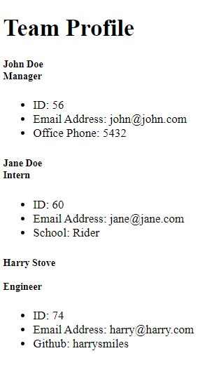

# H8-Team-Profile-Generator
## Description
This is a good resource for HR managers to keep track of employees, their roles, what their id is, and any other misc info they may need. This taught me a lot about using testing to make sure all the paths I created worked, converting Javascript to html, and command line applications.
## Table of Contents
If your README is long, add a table of contents to make it easy for users to find what they need.
- [Installation](#installation)
- [Usage](#usage)
- [Credits](#credits)
- [License](#license)
- [Questions](#questions)
## Installation
1. clone the github repository
2. run npm install
## Usage
- Run the npm test to make sure all the tests pass
- After that, run node index.js and follow the prompts from there
- Open the team.html in your browser and you will see your outputs

   

[Here](https://drive.google.com/drive/folders/1Oi0jspafMf7yvValjC2dg93UHJho69Kj?usp=sharing) is the link to the video walkthrough
[github repository](https://github.com/mollymoo002/H8-Team-Profile-Generator)

## Credits
- Bootstrap
- Ask BCS
- Instructors
## License
MIT License

Copyright (c) [year] [fullname]

Permission is hereby granted, free of charge, to any person obtaining a copy
of this software and associated documentation files (the "Software"), to deal
in the Software without restriction, including without limitation the rights
to use, copy, modify, merge, publish, distribute, sublicense, and/or sell
copies of the Software, and to permit persons to whom the Software is
furnished to do so, subject to the following conditions:

The above copyright notice and this permission notice shall be included in all
copies or substantial portions of the Software.

THE SOFTWARE IS PROVIDED "AS IS", WITHOUT WARRANTY OF ANY KIND, EXPRESS OR
IMPLIED, INCLUDING BUT NOT LIMITED TO THE WARRANTIES OF MERCHANTABILITY,
FITNESS FOR A PARTICULAR PURPOSE AND NONINFRINGEMENT. IN NO EVENT SHALL THE
AUTHORS OR COPYRIGHT HOLDERS BE LIABLE FOR ANY CLAIM, DAMAGES OR OTHER
LIABILITY, WHETHER IN AN ACTION OF CONTRACT, TORT OR OTHERWISE, ARISING FROM,
OUT OF OR IN CONNECTION WITH THE SOFTWARE OR THE USE OR OTHER DEALINGS IN THE
SOFTWARE.
## Badges

## Questions
Github: [mollymoo002](https://github.com/mollymoo002)

Email: mollysingmaster@gmail.com
